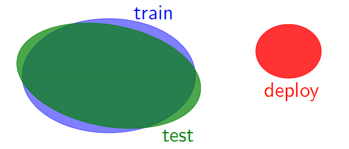
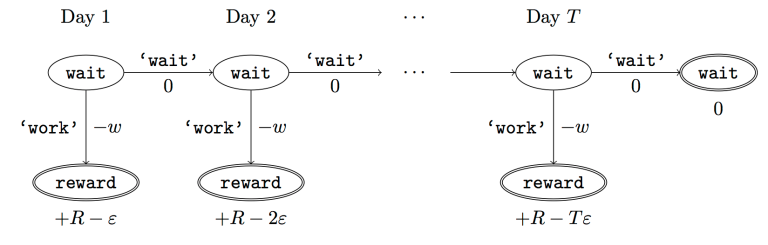
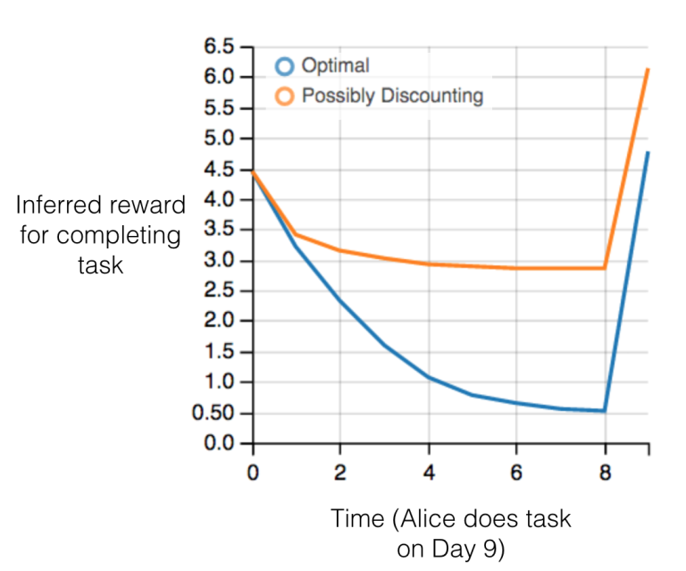

# Course Overview/Security

## Overview of Topics

### Why This Class?

ML systems deployed to billion of users -> more responsibilities

Existing paradigm: supervised learning  -> many ways this can go wrong

### Real World Deployment

+ Inputs change

+ Sensors can fail
+ Test cases may involve novel classes unseen during training
+ Adversaries hack

### Price of Autonomy

+ Deployment scale: too large
+ Time scale: too short
+ Stakes: too high

### Why This Class? (II)

+ Make sure ML systems do what people expect
+ Avoid correlated failures
+ Systems more complex and autonomous
+ New discipline: Reliability Engineering
+ Forward-looking

### Failures and Challenges

1. Failures:

+ Not accurate when out-of-distribution
  + Distribution Shift(Google user habit changes)
  + Exploitability(fake tweets through election)
  + Calibration(99% with respect to what distribution?)

2. Challenges:

+ Care more than just accuracy
  + Fairness
    + Minority subpopulations: underrepresented in data -> underrepresented in society
    + Bias in data: gender-neutral -> gender stereotypes
    + Crucial decisions: recidivism, loans
  + Causality(effect of xxx -> out-of distribution)
  + Privacy(data-driven things -> roll a 6-side dice to answer truthfully)
  + Systems(data not on git -> need to go through logs)
  + Interpretability(for end users/scientists -> probabilistic)

### Other topics

+ Reward/goal specification
+ Human-in-the-loop
+ Incentives
+ Safe exploration
+ Robust control (robotics)

Think about **both motivation and technical details**

 

## Some Basic Frameworks

### Train vs. Deployment

$$
train(data collection) \approx test(deployment)
$$

Real systems can easily violate assumption

### Alternative metrics

+ accuracy on variety of dev sets(distribution shift)
+ accuracy on sub-populations(fairness)
+ worst-case over nearby points(robustness)
+ accuracy after applying intervention(causality)

### Concept: Model Mis-specification

>All models are wrong, but some models are useful.

Supervised(with train = test): mis-specification doesn't matter

Everything else :mis-specification matters

### Mis-specification: Examples

Different input distributions **conflict**

Making decision about doing the assignment

### Aspects of ML:

+ Engineering: build systems that work
+ Science: understand why they work
+ Concepts: mental frameworks for designing/understanding systems
+ Math: formal underpinnings of the above

## Recommended Reading

[Two High-Stakes Challenges in ML](http://videolectures.net/icml2015_bottou_machine_learning/)

[Concrete Problems in AI Safety](https://arxiv.org/pdf/1606.06565.pdf)

[Reflections on Random Kitchen Sinks](http://www.argmin.net/2017/12/05/kitchen-sinks/)

